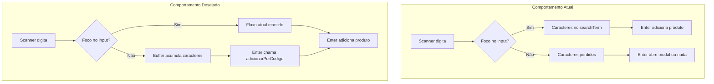

# Plano: Código de Barras Global na Tela de Vendas

## Contexto

O leitor de código de barras USB em modo "keyboard wedge" funciona como teclado: digita os caracteres rapidamente e pressiona Enter. Atualmente, isso só funciona quando o **input de busca** está focado, pois os caracteres vão para o elemento em foco.

**Arquivo principal:** [src/app/caixa/page.tsx](src/app/caixa/page.tsx)

## Fluxo Atual vs Desejado

## Implementação

### 1. Adicionar refs para buffer de código de barras

**Local:** Após as refs existentes (~linha 594), antes do `useEffect` de carregarVendasHojeRef.

- `barcodeBufferRef`: `{ chars: string, lastKeyTime: number }` — acumula caracteres e timestamp
- `barcodeAtalhoTimeoutRef`: `number | null` — timeout para atalhos 1–4

### 2. Modificar o handler de keydown (useEffect ~linhas 2395–2500)

**Ordem das alterações dentro do handler:**

#### 2.1. Entrada de caracteres com foco fora de input

Inserir **antes** dos atalhos 1–4 (antes da linha 2457), dentro do bloco `view === 'venda'`:

- Se `!targetIsInput` e tecla é caractere imprimível (`key.length === 1`, sem Ctrl/Alt/Meta):
  - Se passou > 150ms desde `lastKeyTime`: resetar buffer para `''`
  - Adicionar `key` ao buffer
  - Atualizar `lastKeyTime`
  - `e.preventDefault()` e `return`

#### 2.2. Enter com buffer preenchido (código de barras)

Inserir **antes** do bloco "Enter fora de modais" (linha 2473), logo após o bloco de Enter em modais:

- Se `!targetIsInput` e `key === 'Enter'` e `barcodeBufferRef.current.chars` tem conteúdo:
  - `codigo = barcodeBufferRef.current.chars`
  - Limpar buffer
  - `e.preventDefault()`
  - Chamar `adicionarPorCodigo(codigo)`
  - `return`

#### 2.3. Ajuste dos atalhos 1–4

Substituir a execução imediata dos atalhos 1–4 por lógica com timeout:

- Ao receber `1`, `2`, `3` ou `4` com `!targetIsInput`:
  - Cancelar `barcodeAtalhoTimeoutRef` anterior
  - Adicionar ao buffer (já coberto pelo 2.1)
  - Agendar timeout de 250ms: ao disparar, se buffer tiver exatamente 1 caractere e for `1`–`4`, executar o atalho correspondente e limpar buffer

**Detalhe:** A captura de caracteres (2.1) deve rodar antes dos atalhos. Assim, ao receber `1`, o buffer é preenchido e o timeout é agendado. Se vier `2` em seguida (scanner), o timeout é cancelado e o buffer continua crescendo.

### 3. Limpeza do timeout ao desmontar

Adicionar no `useEffect` de cleanup (já existe um padrão no arquivo) ou no return do próprio `useEffect` de hotkeys:

- `if (barcodeAtalhoTimeoutRef.current) window.clearTimeout(barcodeAtalhoTimeoutRef.current)`

### 4. Condições de ativação

A lógica de buffer e Enter com buffer só deve rodar quando:

- `caixaAberto && view === 'venda'`
- Sem modais de pagamento abertos (`!modalPagamento && !modalDebito && ...`)
- Sem `modalScanner` e sem `modalFechamento` (Enter já tratado em outros blocos)

O early return na linha 2449 (`if (!caixaAberto || view !== 'venda') return`) já restringe o fluxo. Os blocos de Enter para modais (linhas 2441, 2467) tratam os casos com modais abertos.

## Resumo de alterações

| Item            | Ação                                                     |
| --------------- | -------------------------------------------------------- |
| Refs            | Adicionar `barcodeBufferRef` e `barcodeAtalhoTimeoutRef` |
| Handler keydown | Capturar caracteres quando `!targetIsInput`              |
| Handler keydown | Tratar Enter com buffer como código de barras            |
| Handler keydown | Atrasar atalhos 1–4 com timeout de 250ms                 |
| Cleanup         | Limpar timeout no unmount do useEffect                   |

## Função existente utilizada

- `adicionarPorCodigo(codigo: string)` (linha 970): busca produto por código e adiciona ao carrinho; retorna `boolean`.

## Riscos e mitigação

- **Conflito com atalhos 1–4:** mitigado pelo timeout de 250ms; um único dígito executa o atalho após o delay.
- **Input em modais:** quando um modal está aberto, o handler de Enter dos modais roda antes; não há conflito.
- **Scanner lento:** 150ms entre teclas é um limite conservador; scanners típicos digitam em &lt;50ms.

