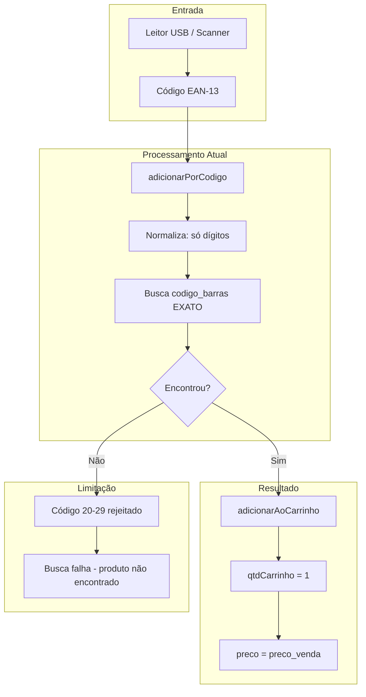
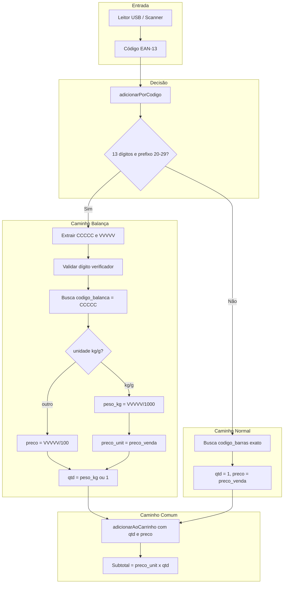
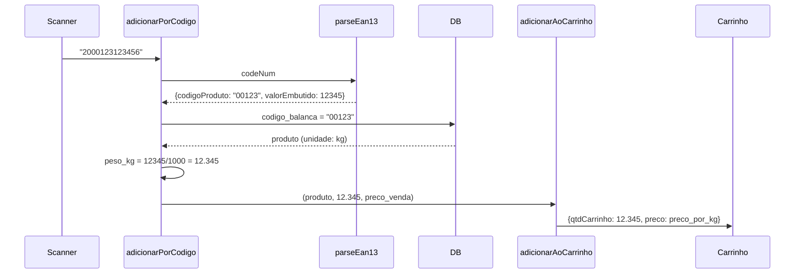

# Plano: Integração com Balança Toledo Prix

## 1. Estado Atual vs Estado Desejado

### 1.1 Diagrama Visual - Fluxo Atual




**Problema:** Códigos de balança (PP 20-29) nunca batem com `codigo_barras` porque o EAN-13 completo inclui peso/valor embutido. O produto é identificado apenas pelos 5 dígitos CCCCC.

---

### 1.2 Diagrama Visual - Fluxo Desejado




---

## 2. Estrutura do EAN-13 de Balança (Prix)


| Posição | Campo | Significado                  | Exemplo |
| ------- | ----- | ---------------------------- | ------- |
| 1-2     | PP    | Prefixo balança (20-29)      | 20      |
| 3-7     | CCCCC | Código interno MGV7          | 00123   |
| 8-12    | VVVVV | Peso (g) ou valor (centavos) | 12345   |
| 13      | D     | Dígito verificador           | 6       |


**Exemplo:** `2000123123456` = Produto 00123, peso 12,345 kg (ou valor R$ 123,45 conforme modo).

---

## 3. Opções Avaliadas e Escolha

### 3.1 Mapeamento CCCCC -> Produto


| Opção                              | Prós                    | Contras                                             |
| ---------------------------------- | ----------------------- | --------------------------------------------------- |
| **A) codigo_barras com 5 dígitos** | Sem migração            | Ambiguidade; produtos com EAN-13 completo não cabem |
| **B) Campo codigo_balanca**        | Explícito, sem conflito | Requer migração                                     |


**Escolha: B** — Evita ambiguidade e permite que o mesmo produto tenha EAN-13 normal e código de balança.

### 3.2 Interpretação de VVVVV


| Opção                      | Prós           | Contras                                        |
| -------------------------- | -------------- | ---------------------------------------------- |
| **A) Só peso**             | Simples        | Não atende produtos com valor fixo na etiqueta |
| **B) Só valor**            | Simples        | Não atende produtos por peso                   |
| **C) Inferir por unidade** | Sem novo campo | unidade kg/g = peso, resto = valor             |
| **D) Campo tipo_balanca**  | Explícito      | Mais uma coluna e migração                     |


**Escolha: C** — Inferir por `unidade`: `kg` ou `g` = peso em gramas; demais = valor em centavos. Padrão em PDVs.

### 3.3 Estoque para Produtos de Balança


| Opção                               | Prós        | Contras                  |
| ----------------------------------- | ----------- | ------------------------ |
| **A) Ignorar estoque**              | Simples     | Sem controle             |
| **B) Estoque em kg**                | Consistente | Exige cadastro correto   |
| **C) Tratar null/0 como ilimitado** | Flexível    | Pode vender sem controle |


**Escolha: B + C** — Se `estoque_atual` for null ou 0, não validar. Se > 0 e `unidade` kg/g, validar em kg.

---

## 4. Alterações Necessárias

### 4.1 Migração SQL

**Arquivo:** `scripts/migrations/2026-01-30-add-codigo-balanca-varejo.sql`

```sql
ALTER TABLE varejo ADD COLUMN IF NOT EXISTS codigo_balanca TEXT;
CREATE INDEX IF NOT EXISTS idx_varejo_codigo_balanca ON varejo(codigo_balanca) WHERE codigo_balanca IS NOT NULL;
```

### 4.2 Tipos TypeScript

**Arquivo:** [src/lib/supabase/types.ts](src/lib/supabase/types.ts)

- Incluir `codigo_balanca?: string | null` em Row, Insert e Update de `varejo`.

### 4.3 Função de Parsing

**Arquivo:** [src/app/caixa/page.tsx](src/app/caixa/page.tsx)

Criar helper `parseEan13Balança(codeNum: string)` que retorna:

- `{ tipo: 'balanca', codigoProduto: string, valorEmbutido: number }` ou
- `null` se não for código de balança.

Incluir validação do dígito verificador EAN-13.

### 4.4 Alteração em adicionarPorCodigo

**Arquivo:** [src/app/caixa/page.tsx](src/app/caixa/page.tsx) (linhas 1224-1266)

Fluxo:

1. Normalizar código.
2. Chamar `parseEan13Balança(codeNum)`.
3. Se for balança:
  - Buscar produto por `codigo_balanca = CCCCC` (local e Supabase).
  - Calcular `peso_kg` ou `preco_total` conforme `unidade`.
  - Chamar `adicionarAoCarrinhoComPesoOuPreco(produto, qtd, precoUnit)`.
4. Senão: manter fluxo atual (busca por `codigo_barras`).

### 4.5 Nova Função adicionarAoCarrinhoComPesoOuPreco

**Arquivo:** [src/app/caixa/page.tsx](src/app/caixa/page.tsx)

Assinatura: `adicionarAoCarrinhoComPesoOuPreco(produto: Produto, qtd: number, precoUnit: number)`.

- Para produtos de balança: adiciona com `qtdCarrinho = qtd` e `preco` sobrescrito por `precoUnit`.
- Reutilizar lógica de merge por `produto.id` quando fizer sentido (ex.: mesmo produto, pesos diferentes).
- Estoque: se `unidade` kg/g e `estoque_atual` > 0, validar `qtdCarrinho <= estoque_atual`; se null/0, não validar.

### 4.6 Ajustes de UX no Carrinho

**Arquivo:** [src/app/caixa/page.tsx](src/app/caixa/page.tsx) (linhas 3324-3342)

- Quando `unidade === 'kg'` ou `'g'`: exibir quantidade como peso (ex.: "1,234 kg") em vez de número genérico.
- Coluna "Unit" pode mostrar "R$/kg" para produtos por peso.
- Botões +/-: para itens por peso, incrementar/decrementar em 0,1 kg (ou 0,05 kg) em vez de 1.

### 4.7 Gestão de Estoque (cadastro)

**Arquivo:** [src/app/gestao/estoque/page.tsx](src/app/gestao/estoque/page.tsx)

- Incluir campo `codigo_balanca` no formulário de varejo.
- Exibir quando o produto for de balança (ex.: `unidade` kg/g).
- Validação: `codigo_balanca` com 5 dígitos numéricos.

---

## 5. Fluxo de Dados Completo




---

## 6. Validação do Dígito Verificador EAN-13

Algoritmo padrão:

1. Somar dígitos em posições ímpares (1, 3, 5...) x 1.
2. Somar dígitos em posições pares (2, 4, 6...) x 3.
3. Soma % 10 = 0 → dígito correto; senão → código inválido.

Rejeitar códigos com dígito incorreto para evitar erros de leitura.

---

## 7. Casos de Teste


| Cenário                | Entrada                    | Esperado                                          |
| ---------------------- | -------------------------- | ------------------------------------------------- |
| Produto comum          | 7891234567890              | Busca codigo_barras, qtd=1                        |
| Balança peso           | 2000123123456              | CCCCC=00123, peso=12.345kg, preco=preco_kg x peso |
| Balança valor          | 2000123123456 (unidade=un) | CCCCC=00123, preco=R$123,45, qtd=1                |
| Código inválido        | 2000123123450 (DV errado)  | Rejeitar, retornar false                          |
| Produto não cadastrado | 2099999123456              | Retornar false, toast "Produto não encontrado"    |
| Offline                | Código balança             | Usar cache local por codigo_balanca               |


---

## 8. Riscos e Mitigações


| Risco                                    | Mitigação                                    |
| ---------------------------------------- | -------------------------------------------- |
| VVVVV ambíguo (peso vs valor)            | Inferir por `unidade`; documentar convenção  |
| Conflito codigo_barras vs codigo_balanca | Campo separado `codigo_balanca`              |
| Baixa de estoque incorreta               | Usar `qtdCarrinho` em kg quando unidade kg/g |
| Display de quantidade confuso            | Formatar "X,XXX kg" para itens por peso      |


---

## 9. Resumo de Arquivos


| Arquivo                                                       | Ação                                                                                  |
| ------------------------------------------------------------- | ------------------------------------------------------------------------------------- |
| `scripts/migrations/2026-01-30-add-codigo-balanca-varejo.sql` | Criar                                                                                 |
| `src/lib/supabase/types.ts`                                   | Adicionar codigo_balanca                                                              |
| `src/app/caixa/page.tsx`                                      | parseEan13Balança, adicionarPorCodigo, adicionarAoCarrinhoComPesoOuPreco, UX carrinho |
| `src/app/gestao/estoque/page.tsx`                             | Campo codigo_balanca no formulário                                                    |
| `docs/app-pages/page-caixa-fluxo-codigo-barras.md`            | Documentar fluxo balança                                                              |


