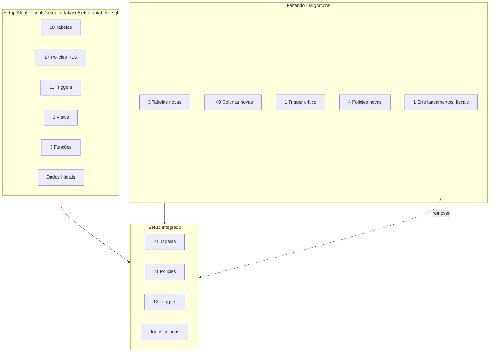
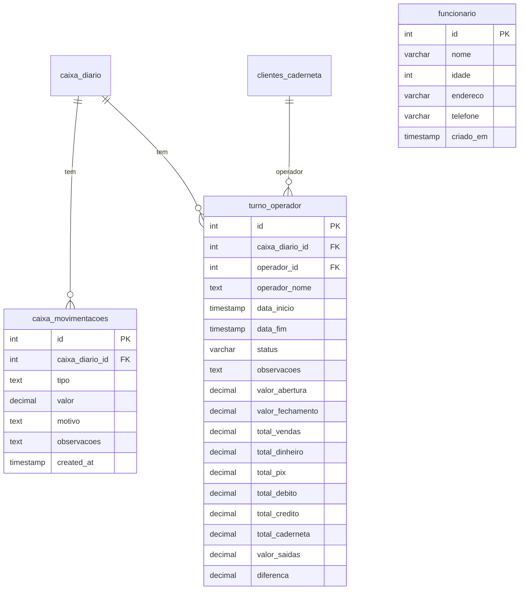
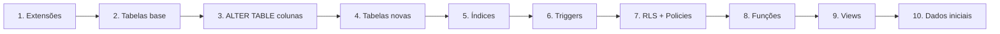
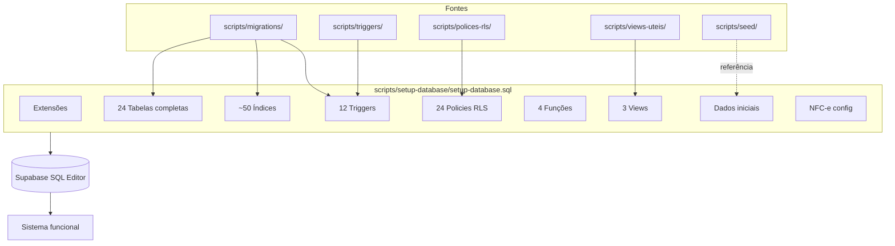

# Plano de Integração Completa do Setup Database

## 1. Estado Atual vs. Estado Alvo

---

## 2. O Que JÁ Existe no Setup (Completo)

### 2.1 Tabelas (18)

| Tabela                  | Status                                      |
| ----------------------- | ------------------------------------------- |
| usuarios                | OK                                          |
| insumos                 | OK (falta 4 colunas - ver seção 4)          |
| receitas                | OK                                          |
| receita_ingredientes    | OK                                          |
| produtos                | OK                                          |
| varejo                  | OK (falta 9 colunas - ver seção 4)          |
| clientes                | OK                                          |
| caixas                  | OK                                          |
| vendas                  | OK (falta 4 colunas - ver seção 4)          |
| venda_itens             | OK (varejo_id já incluído)                  |
| caderneta               | OK                                          |
| estoque_movimentacoes   | OK                                          |
| custos_fixos            | OK                                          |
| logs_sistema            | OK                                          |
| clientes_caderneta      | OK                                          |
| movimentacoes_caderneta | OK (falta saldo_devedor)                    |
| caixa_diario            | OK estrutura base (falta 8 colunas total_*) |
| fluxo_caixa             | OK                                          |
| precos_venda            | OK (falta 5 colunas)                        |
| composicao_receitas     | OK                                          |
| nfce_config             | OK                                          |

### 2.2 Triggers (11)

- `update_updated_at` em: usuarios, insumos, receitas, produtos, varejo, clientes, caixas, vendas, custos_fixos, composicao_receitas
- `trigger_atualizar_estoque_venda` em venda_itens

### 2.3 Funções

- `update_updated_at_column()`
- `atualizar_estoque_venda()`
- `get_saldo_caderneta()`
- `get_proximo_numero_venda()`

### 2.4 Views

- `vendas_hoje`, `produtos_estoque_baixo`, `resumo_caixa_hoje`

### 2.5 Dados Iniciais

- Usuário admin, insumos, receitas, receita_ingredientes, produtos, custos_fixos

---

## 3. O Que NÃO Existe (A Integrar)

### 3.1 Tabelas Novas (3)

| Tabela              | Fonte                                                                                                                                                                                                                   | Ordem                                 |
| ------------------- | ----------------------------------------------------------------------------------------------------------------------------------------------------------------------------------------------------------------------- | ------------------------------------- |
| caixa_movimentacoes | [0001_create_caixa_movimentacoes_and_cols.sql](scripts/migrations/0001_create_caixa_movimentacoes_and_cols.sql)                                                                                                         | Após caixa_diario                     |
| funcionario         | [2026-01-25-create-funcionario.sql](scripts/migrations/2026-01-25-create-funcionario.sql)                                                                                                                               | Nova                                  |
| turno_operador      | [2026-01-25-create-turno-operador.sql](scripts/migrations/2026-01-25-create-turno-operador.sql) + [2026-01-28-add-operador-to-vendas-and-turno.sql](scripts/migrations/2026-01-28-add-operador-to-vendas-and-turno.sql) | Após caixa_diario, clientes_caderneta |

### 3.2 Trigger Crítico (1)

| Trigger             | Função                                                             | Fonte                                                                           |
| ------------------- | ------------------------------------------------------------------ | ------------------------------------------------------------------------------- |
| trg_on_venda_insert | on_venda_insert() - atualiza caixa_diario e fluxo_caixa após venda | [0000_venda_caixa_trigger.sql](scripts/migrations/0000_venda_caixa_trigger.sql) |

### 3.3 Colunas Faltantes (por tabela)

| Tabela                  | Colunas a adicionar                                                                                                                           |
| ----------------------- | --------------------------------------------------------------------------------------------------------------------------------------------- |
| caixa_diario            | total_vendas, total_entradas, total_dinheiro, total_pix, total_debito, total_credito, total_caderneta, total_saidas, diferenca, tipo_abertura |
| vendas                  | caixa_diario_id, usuario (TEXT), operador_nome, operador_id                                                                                   |
| insumos                 | unidade_medida_base, quantidade_pacote, preco_unitario, quantidade_minima                                                                     |
| varejo                  | preco_pacote, peso_pacote, marca, fornecedor, unidade_medida_base, quantidade_pacote, quantidade_minima, preco_unitario, codigo_balanca       |
| fluxo_caixa             | usuario (já existe)                                                                                                                           |
| movimentacoes_caderneta | saldo_devedor                                                                                                                                 |
| precos_venda            | preco_custo_unitario, margem_lucro, item_nome, categoria, unidade, estoque                                                                    |

### 3.4 Policies RLS Faltantes (4)

- caixa_movimentacoes
- funcionario
- turno_operador
- nfce_config

### 3.5 Erro a Corrigir

- **Linha 587**: Remover `ALTER TABLE lancamentos_fiscais ENABLE ROW LEVEL SECURITY` (tabela não existe)

### 3.6 Constraint a Garantir

- clientes_caderneta: NÃO criar `chk_saldo_devedor_nonnegative` (permite saldo credor)

---

## 4. Estratégia de Integração (Ordem de Execução)

### 4.1 Onde Inserir Cada Bloco

| Bloco                           | Local no setup-database.sql                            | Ação                                                                                              |
| ------------------------------- | ------------------------------------------------------ | ------------------------------------------------------------------------------------------------- |
| Colunas caixa_diario            | Após CREATE TABLE caixa_diario (linha ~333)            | ALTER TABLE ADD COLUMN para total_*, tipo_abertura                                                |
| Colunas vendas                  | Após CREATE TABLE vendas (linha ~186)                  | ALTER TABLE ADD COLUMN caixa_diario_id, usuario, operador_nome, operador_id                       |
| Colunas insumos                 | Após CREATE TABLE insumos (linha ~46)                  | ALTER TABLE ADD COLUMN unidade_medida_base, quantidade_pacote, preco_unitario, quantidade_minima  |
| Colunas varejo                  | Após CREATE TABLE varejo (linha ~129)                  | ALTER TABLE ADD COLUMN preco_pacote, peso_pacote, marca, fornecedor, etc.                         |
| Colunas movimentacoes_caderneta | Após CREATE TABLE movimentacoes_caderneta (linha ~310) | ALTER TABLE ADD COLUMN saldo_devedor                                                              |
| Colunas precos_venda            | Após CREATE TABLE precos_venda (linha ~359)            | ALTER TABLE ADD COLUMN preco_custo_unitario, margem_lucro, item_nome, categoria, unidade, estoque |
| Tabela caixa_movimentacoes      | Após caixa_diario, antes fluxo_caixa                   | CREATE TABLE                                                                                      |
| Tabela funcionario              | Após logs_sistema                                      | CREATE TABLE                                                                                      |
| Tabela turno_operador           | Após caixa_movimentacoes                               | CREATE TABLE                                                                                      |
| Trigger trg_on_venda_insert     | Após trigger_atualizar_estoque_venda (linha ~416)      | CREATE FUNCTION + CREATE TRIGGER                                                                  |
| Remover lancamentos_fiscais     | Linha 587                                              | Deletar linha                                                                                     |
| Policies novas                  | Após composicao_receitas policy (linha ~703)           | CREATE POLICY para caixa_movimentacoes, funcionario, turno_operador, nfce_config                  |

---

## 5. Checklist de Garantia (Nada Faltando)

### 5.1 Tabelas (21 total)

| #   | Tabela                  | No setup?     |
| --- | ----------------------- | ------------- |
| 1   | usuarios                | Sim           |
| 2   | insumos                 | Sim           |
| 3   | receitas                | Sim           |
| 4   | receita_ingredientes    | Sim           |
| 5   | produtos                | Sim           |
| 6   | varejo                  | Sim           |
| 7   | clientes                | Sim           |
| 8   | caixas                  | Sim           |
| 9   | vendas                  | Sim           |
| 10  | venda_itens             | Sim           |
| 11  | caderneta               | Sim           |
| 12  | estoque_movimentacoes   | Sim           |
| 13  | custos_fixos            | Sim           |
| 14  | logs_sistema            | Sim           |
| 15  | clientes_caderneta      | Sim           |
| 16  | movimentacoes_caderneta | Sim           |
| 17  | caixa_diario            | Sim           |
| 18  | fluxo_caixa             | Sim           |
| 19  | precos_venda            | Sim           |
| 20  | composicao_receitas     | Sim           |
| 21  | nfce_config             | Sim           |
| 22  | caixa_movimentacoes     | **Adicionar** |
| 23  | funcionario             | **Adicionar** |
| 24  | turno_operador          | **Adicionar** |

### 5.2 Policies RLS (21 tabelas com RLS)

Todas as 21 tabelas acima devem ter: `ENABLE ROW LEVEL SECURITY` + pelo menos 1 policy `FOR ALL` ou equivalente.

### 5.3 Triggers (12 total)

| Trigger                         | Tabela      | Status        |
| ------------------------------- | ----------- | ------------- |
| update_*_updated_at             | 9 tabelas   | Sim           |
| trigger_atualizar_estoque_venda | venda_itens | Sim           |
| trg_on_venda_insert             | vendas      | **Adicionar** |

### 5.4 Índices Adicionais

- idx_venda_itens_varejo_id (já existe)
- idx_vendas_caixa_diario_id (adicionar)
- idx_vendas_operador_nome (adicionar)
- idx_turno_operador_* (3 índices - adicionar com tabela)
- idx_funcionario_nome (adicionar com tabela)
- idx_varejo_codigo_balanca (adicionar)
- idx_insumos_quantidade_minima (adicionar)

---

## 6. Ajuste no Seed (receita_ingredientes)

O [scripts/seed/dados-inicias.sql](scripts/seed/dados-inicias.sql) insere em `receita_ingredientes` com coluna `categoria`, que não existe. Duas opções:

- **Opção A**: Adicionar `categoria` em `receita_ingredientes` (ALTER TABLE) e manter seed atual
- **Opção B**: Alterar seed para NÃO usar categoria (remover da lista de colunas no INSERT)

O setup atual já insere dados iniciais inline; o seed em `scripts/seed/` é redundante. O setup usa `receita_ingredientes` sem categoria e com `ON CONFLICT (receita_id, insumo_id)` - a tabela tem UNIQUE(receita_id, insumo_id). O INSERT do setup NÃO inclui categoria. **Conclusão**: O seed em scripts/seed/ está desatualizado; o setup inline está correto. Nenhuma alteração necessária no setup para dados iniciais.

---

## 7. Resumo Visual Final

---

## 8. Arquivos a Modificar

- **[scripts/setup-database/setup-database.sql](scripts/setup-database/setup-database.sql)**: único arquivo a editar; todas as alterações entram nele.

## 9. Arquivos de Referência (somente leitura)

- scripts/migrations/*.sql
- scripts/polices-rls/politicas-rls.sql
- scripts/triggers/triggers.sql
- scripts/views-uteis/views-uteis.sql
- scripts/seed/dados-inicias.sql

