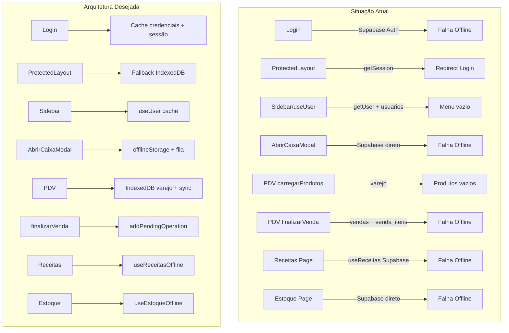
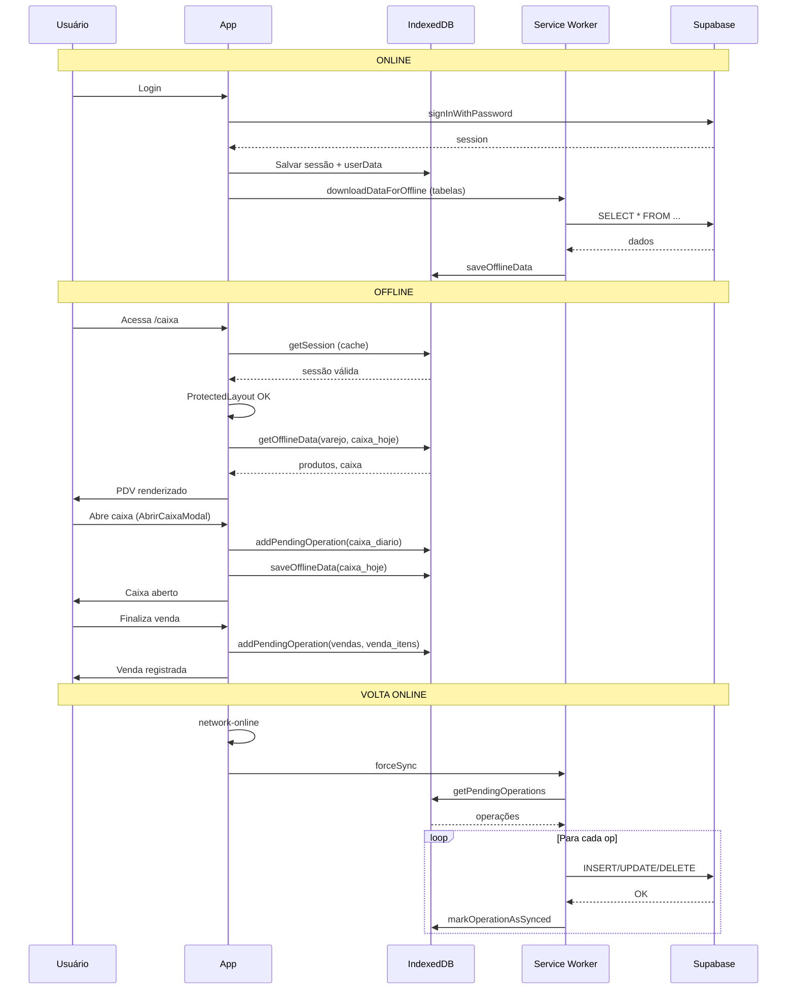

# Plano: Sistema Offline Completo - Rey dos Pães

## Objetivo

Fazer o sistema funcionar **offline igual ao online**: vendas, abertura/fechamento de caixa, receitas, estoque, caderneta, login e área administrativa. A padaria não pode parar de vender quando a internet cair.

---

## Arquitetura Atual vs. Desejada

---

## Parte 1: Autenticação e Layout (Bloco de Entrada)

### 1.1 Login Offline

**Arquivo:** [src/app/login/page.tsx](src/app/login/page.tsx)

**Problema:** `supabase.auth.signInWithPassword()` sempre faz requisição HTTP. Offline = erro "email ou senha incorretos".

**Solução:**

- Ao fazer login **online** com sucesso: salvar hash de validação (não a senha) + dados do usuário em IndexedDB (`offlineConfig` ou nova store `authCache`).
- Ao tentar login **offline**: verificar `navigator.onLine`; se offline, buscar credenciais cacheadas e validar localmente (comparar hash).
- Exibir mensagem clara: "Modo offline: usando sessão em cache. Reconecte para login completo."

**Segurança:** Usar `crypto.subtle` para derivar um hash da senha (PBKDF2 ou similar) e armazenar apenas o hash. Nunca armazenar senha em texto puro.

### 1.2 ProtectedLayout Offline

**Arquivo:** [src/components/ProtectedLayout.tsx](src/components/ProtectedLayout.tsx)

**Problema:** `supabase.auth.getSession()` pode falhar ou retornar null offline; redireciona para `/login` mesmo com sessão válida em localStorage.

**Solução:**

- Usar `getSession()` (lê localStorage primeiro) em vez de `getUser()` para verificação inicial.
- Se `getSession()` retornar sessão válida, permitir acesso mesmo offline.
- Se falhar (ex.: timeout de rede), tentar ler sessão do localStorage diretamente e validar token JWT localmente (verificar expiração).
- Só redirecionar para `/login` se não houver sessão válida em cache.

### 1.3 useUser Offline

**Arquivo:** [src/hooks/useUser.ts](src/hooks/useUser.ts)

**Problema:** `supabase.auth.getUser()` e `supabase.from('usuarios').select()` exigem rede. Sidebar fica em "Carregando menu..." ou vazio.

**Solução:**

- Se offline: buscar `userData` e `role` do IndexedDB (`offlineConfig` ou `authCache`).
- Ao fazer login online, salvar `{ user, userData, role }` em cache.
- `getMenuConfig(role, isUnlocked)` continuará funcionando com role em cache.
- Manter `globalUserData` como fallback quando fetch falhar.

---

## Parte 2: Caixa e PDV (Núcleo Operacional)

### 2.1 AbrirCaixaModal Offline

**Arquivo:** [src/components/AbrirCaixaModal.tsx](src/components/AbrirCaixaModal.tsx)

**Problema:** Tudo via Supabase: `funcionario`, verificação de caixa aberto, insert em `caixa_diario`, insert em `turno_operador`.

**Solução:**

- Injetar `useOnlineStatus()` e `offlineStorage`.
- **Online:** manter fluxo atual.
- **Offline:**
  1. Carregar `funcionario` do cache (`offlineStorage.getOfflineData('funcionario')`).
  2. Verificar caixa aberto no cache (`offlineStorage.getOfflineData('caixa_hoje')`).
  3. Se não houver caixa aberto: criar payload e `offlineStorage.addPendingOperation({ type: 'INSERT', table: 'caixa_diario', data })`.
  4. Gerar ID temporário (ex.: `temp_${Date.now()}`) para o caixa e salvar em `caixa_hoje` no IndexedDB.
  5. Chamar `onCaixaAberto()` para atualizar UI.
- Incluir `turno_operador` na fila de sincronização (INSERT com `caixa_diario_id` temporário; syncService precisará mapear IDs na sincronização).

### 2.2 syncService - Tabelas para Download

**Arquivo:** [src/lib/syncService.ts](src/lib/syncService.ts)

**Problema:** `downloadDataForOffline()` baixa apenas: `insumos`, `receitas`, `vendas`, `clientes_caderneta`, `caixa_diario`. Faltam tabelas críticas.

**Solução:** Incluir no download:

- `varejo` (produtos do PDV)
- `composicao_receitas` (receitas com ingredientes)
- `funcionario` (operadores do AbrirCaixaModal)
- `precos_venda` ou equivalente (preços)
- `fluxo_caixa` (saídas)
- `usuarios` (para useUser offline)
- `movimentacoes_caderneta` (caderneta)
- `venda_itens` (itens das vendas - opcional, para histórico)

### 2.3 Página Caixa (PDV) - carregarProdutos Offline

**Arquivo:** [src/app/caixa/page.tsx](src/app/caixa/page.tsx) - função `carregarProdutos` (linha ~830)

**Problema:** Consulta `varejo` via Supabase. Offline = produtos vazios.

**Solução:**

- Verificar `navigator.onLine` ou `useOnlineStatus()`.
- Se offline: `offlineStorage.getOfflineData('varejo')` e mapear para `Produto[]`.
- Se online: manter fluxo atual e salvar resultado em cache (`offlineStorage.saveOfflineData('varejo', data)`).

### 2.4 Página Caixa - restaurarCaixaAberto Offline

**Arquivo:** [src/app/caixa/page.tsx](src/app/caixa/page.tsx) - função `restaurarCaixaAberto` (linha ~193)

**Problema:** Busca `caixa_diario` via Supabase. Offline = sempre `caixaAberto = false`.

**Solução:**

- Se offline: buscar `offlineStorage.getOfflineData('caixa_hoje')` ou `caixa_diario` em cache.
- Se houver caixa aberto no cache, preencher `caixaAberto`, `caixaDiarioId`, `operador`, etc.
- Usar ID temporário se o caixa foi aberto offline.

### 2.5 Página Caixa - finalizarVenda Offline

**Arquivo:** [src/app/caixa/page.tsx](src/app/caixa/page.tsx) - função `finalizarVenda` (linha ~1391)

**Problema:** Insere em `vendas` e `venda_itens` via Supabase. Offline = falha.

**Solução:**

- Verificar `isOnline` no início.
- Se offline:
  1. Gerar ID temporário para a venda (ex.: `temp_venda_${Date.now()}`).
  2. `offlineStorage.addPendingOperation({ type: 'INSERT', table: 'vendas', data: payload })`.
  3. Para cada item: `addPendingOperation({ type: 'INSERT', table: 'venda_itens', data: item })`.
  4. Se caderneta: `addPendingOperation` para `movimentacoes_caderneta` e update em `clientes_caderneta`.
  5. Atualizar estado local (vendasHoje, carrinho vazio, etc.) sem esperar Supabase.
- O syncService já processa `INSERT` em `vendas` e `venda_itens`; garantir que o payload esteja correto (incluindo `caixa_diario_id` que pode ser temporário).

### 2.6 Página Caixa - handleRegistrarSaida (Sangria) Offline

**Arquivo:** [src/app/caixa/page.tsx](src/app/caixa/page.tsx) - função `handleRegistrarSaida` (linha ~314)

**Problema:** Update em `caixa_diario`, insert em `caixa_movimentacoes` e `fluxo_caixa` via Supabase.

**Solução:**

- Se offline: `addPendingOperation` para UPDATE em `caixa_diario` e INSERT em `fluxo_caixa`.
- Atualizar estado local (saidasDoDia, metricasCaixa) com os valores informados.

### 2.7 Página Caixa - Fechamento de Caixa Offline

**Arquivo:** [src/app/caixa/page.tsx](src/app/caixa/page.tsx) - `handleConfirmFechamento` e fluxo de fechamento

**Problema:** Update em `caixa_diario` (status fechado, valores) via Supabase.

**Solução:**

- Se offline: `addPendingOperation({ type: 'UPDATE', table: 'caixa_diario', data: { id, status: 'fechado', ... } })`.
- Atualizar estado local (caixaAberto = false, etc.).

### 2.8 Página Caixa - Outras Funções

- `carregarVendasHoje`: offline → `offlineStorage.getOfflineData('vendas_hoje')` ou filtrar vendas em cache por `caixa_diario_id`.
- `carregarSaidasDoDia`: offline → `offlineStorage.getOfflineData('fluxo_caixa')` filtrado.
- `carregarCaixasDoDia`: offline → cache de `caixa_diario`.
- `registerMovimentacaoDb` (caderneta): já existe `useCadernetaOffline` com `adicionarMovimentacao`; a página caixa usa `registerMovimentacaoDb` diretamente em alguns fluxos. Unificar para usar `adicionarMovimentacao` do hook quando caderneta.

### 2.9 Troca de Operador e Turno

**Arquivos:** [src/services/turnoOperadorService.ts](src/services/turnoOperadorService.ts), [src/repositories/turnoOperadorRepository.ts](src/repositories/turnoOperadorRepository.ts)

**Problema:** Supabase direto.

**Solução:** Adicionar fallback offline: salvar em fila e atualizar estado local (operador no header).

---

## Parte 3: Receitas, Estoque e Configurações

### 3.1 Página Receitas

**Arquivo:** [src/app/receitas/page.tsx](src/app/receitas/page.tsx)

**Problema:** Usa `useReceitas()`, `useInsumos()`, `useComposicoesFull()`, `useComposicoes()` - todos Supabase direto. Existe `useReceitasOffline` mas não é usado.

**Solução:**

- Trocar para `useReceitasOffline` (já cobre receitas, composicao_receitas, insumos).
- Para create/update/delete: o hook já usa `useOfflineData` com `addItem`, `updateItem`, `deleteItem`.
- Garantir que `composicao_receitas` esteja no `downloadDataForOffline` e que o syncService processe INSERT/UPDATE/DELETE nessa tabela.

### 3.2 Página Estoque

**Arquivo:** [src/app/estoque/page.tsx](src/app/estoque/page.tsx)

**Problema:** `carregarItens` consulta `insumos` e `varejo` via Supabase.

**Solução:**

- Usar `useEstoqueOffline` (já existe) ou implementar fallback: `offlineStorage.getOfflineData('insumos')` e `getOfflineData('varejo')` quando offline.
- Para edição de estoque: `addPendingOperation` para UPDATE.

### 3.3 Página Configurações

**Arquivo:** [src/app/configuracoes/page.tsx](src/app/configuracoes/page.tsx)

**Problema:** `supabase.auth.getUser()` para exibir perfil; `signOut` para logout.

**Solução:**

- getUser: fallback para dados em cache (IndexedDB ou localStorage).
- signOut: limpar cache local e redirecionar; em offline, apenas limpar cache e redirecionar (signOut do Supabase falhará, mas o usuário será deslogado localmente).

---

## Parte 4: Área Administrativa

### 4.1 AdminUnlockModal (Desbloqueio Admin) Offline

**Arquivo:** [src/hooks/useAdminUnlock.ts](src/hooks/useAdminUnlock.ts)

**Problema:** `signInWithPassword` e consulta `usuarios` exigem rede. Offline = "email ou senha incorretos".

**Solução:**

- Se offline: validar contra credenciais cacheadas (mesmo mecanismo do login offline).
- Se o admin/gerente já validou online nesta sessão, manter `sessionStorage` e permitir desbloqueio offline.
- Ou: permitir desbloqueio offline se `userData` em cache tiver role admin/gerente e houver hash de senha válido em cache (mesma lógica do login offline).

### 4.2 Páginas de Gestão (Dashboard, Caixas, Vendas, Preços, etc.)

**Arquivos:** [src/app/gestao/dashboard/page.tsx](src/app/gestao/dashboard/page.tsx), [src/app/gestao/caixas/page.tsx](src/app/gestao/caixas/page.tsx), [src/app/gestao/vendas/page.tsx](src/app/gestao/vendas/page.tsx), [src/app/gestao/precos/page.tsx](src/app/gestao/precos/page.tsx), etc.

**Problema:** Todas usam Supabase direto para listar e editar dados.

**Solução (prioridade média):**

- Dashboard: ler dados agregados do cache (vendas, caixa_diario).
- Caixas, Vendas, Saídas: usar `offlineStorage.getOfflineData` para exibir listas; edições via `addPendingOperation`.
- Preços, Operadores, Estoque gestão: mesmo padrão.
- Páginas "Em breve" (Fiscal, Pagamentos): podem permanecer apenas online por enquanto.

---

## Parte 5: Service Worker e PWA

### 5.1 Habilitar PWA por Padrão

**Arquivo:** [src/components/OfflineProvider.tsx](src/components/OfflineProvider.tsx)

**Problema:** Service Worker só é registrado se `NEXT_PUBLIC_ENABLE_PWA === 'true'`. Se desabilitado, nada do offline funciona.

**Solução:** Garantir que em produção `NEXT_PUBLIC_ENABLE_PWA=true` ou remover a condição e sempre registrar o SW quando suportado.

### 5.2 Service Worker - Cache de Rotas

**Arquivo:** [public/sw.js](public/sw.js)

**Problema:** `STATIC_FILES` inclui apenas `/`, manifest, favicon, ícones. Páginas como `/caixa`, `/receitas` não estão em cache.

**Solução:**

- Estratégia `networkFirstWithFallback` já existe para páginas.
- Garantir que as rotas principais sejam cacheadas quando visitadas online (o SW já faz isso para `isPageRequest`).
- Adicionar rotas críticas ao precache: `/`, `/login`, `/caixa`, `/receitas`, `/estoque` (opcional, para primeira visita offline).
- Verificar se `/offline.html` existe e está acessível.

### 5.3 Background Sync

**Arquivo:** [public/sw.js](public/sw.js) - função `syncPendingOperations`

**Problema:** A função atual apenas simula com `setTimeout`. Não chama o syncService real.

**Solução:** O sync real é feito pelo `syncService.forceSync()` no client quando `network-online` dispara. O SW pode enviar mensagem ao client para disparar sync. Manter o listener `network-online` no syncService como principal; o Background Sync do SW pode ser usado para tentar sync quando o app estiver em background (requer `registration.sync.register('sync-data')`).

---

## Parte 6: Sincronização e IDs Temporários

### 6.1 Mapeamento de IDs Temporários

**Problema:** Ao criar `caixa_diario` ou `vendas` offline, usamos IDs temporários. Na sincronização, `venda_itens.venda_id` e `fluxo_caixa.caixa_diario_id` referenciam esses IDs.

**Solução:**

- Ordenar operações na sincronização: primeiro INSERT de entidades pai (caixa_diario, vendas), depois filhos (venda_itens, fluxo_caixa, turno_operador).
- Ao processar INSERT de `vendas`, o Supabase retorna o ID real. Manter mapa `tempId -> realId` em memória durante o batch.
- Ao processar INSERT de `venda_itens`, substituir `venda_id` temporário pelo real antes de enviar ao Supabase.
- Para `caixa_diario` criado offline: o syncService já evita duplicar (verifica por data). O INSERT retornará o ID real; operações pendentes que referenciam o caixa precisarão ser atualizadas com o ID real (ou o syncService processa em ordem e usa o ID retornado).

### 6.2 Estrutura de addPendingOperation para INSERT

Garantir que o `data` em `addPendingOperation` para INSERT contenha todos os campos necessários. Para `venda_itens`, incluir `venda_id` (temporário) e o syncService fará a substituição ao processar.

---

## Parte 7: Fluxo Visual Resumido

---

## Ordem de Implementação Sugerida

1. **syncService** - Ampliar `downloadDataForOffline` com todas as tabelas necessárias.
2. **ProtectedLayout + useUser** - Fallback para sessão e userData em cache.
3. **Login** - Cache de credenciais e validação offline.
4. **AbrirCaixaModal** - Suporte offline completo.
5. **Página Caixa** - restaurarCaixaAberto, carregarProdutos, finalizarVenda, handleRegistrarSaida, fechamento.
6. **Página Receitas** - Migrar para useReceitasOffline.
7. **Página Estoque** - Fallback offline.
8. **AdminUnlock** - Validação offline.
9. **Configurações** - Fallback para getUser.
10. **Service Worker** - Precache de rotas, garantir PWA habilitado.
11. **Gestão** - Dashboard, Caixas, Vendas, etc. (prioridade menor).

---

## Verificação Final

Após implementação, validar:

- Login online e offline (com sessão em cache).
- Abertura e fechamento de caixa offline.
- Registro de vendas offline (dinheiro, pix, débito, crédito, caderneta).
- Sangria/saída offline.
- Navegação no sidebar (todas as abas visíveis).
- Página Receitas carregando e editando offline.
- Página Estoque carregando offline.
- Desbloqueio do menu admin offline (se já desbloqueado online).
- Sincronização ao voltar online (operações pendentes enviadas).
- Conflitos resolvidos pelo ConflictResolver quando houver divergências.

