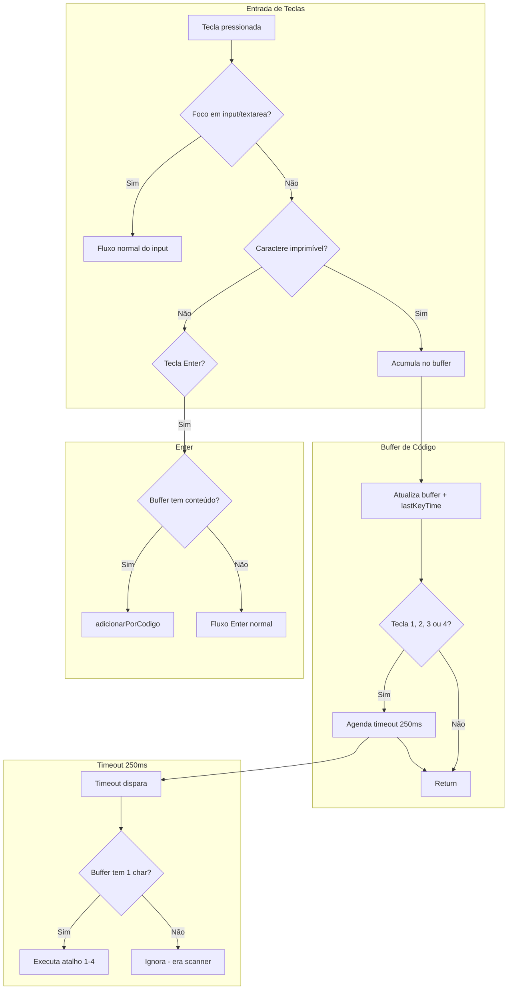
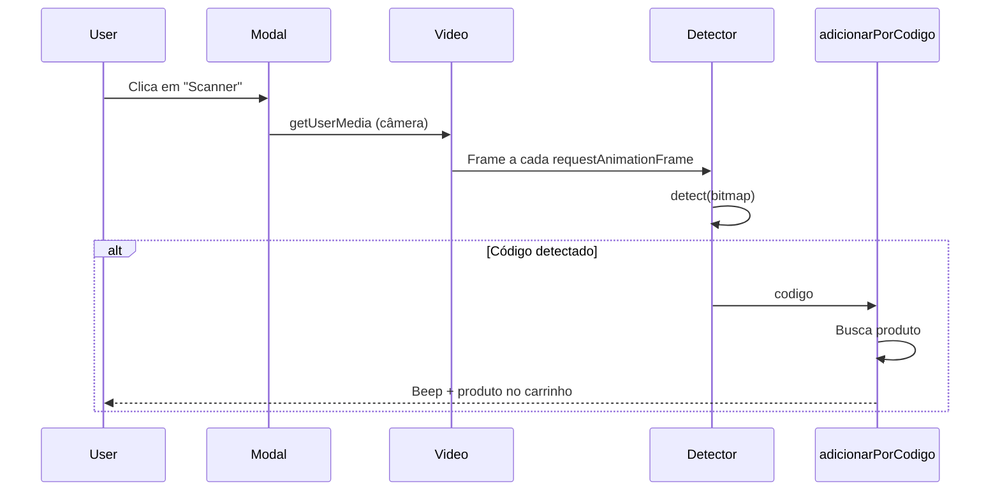
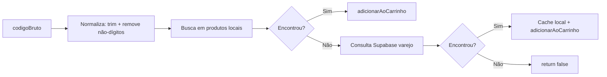

# Fluxo de Código de Barras na Tela de Caixa (PDV)

**Arquivo:** `src/app/caixa/page.tsx`

## 1. Visão Geral

O sistema suporta **dois tipos** de leitura de código de barras na tela de vendas:

| Tipo | Descrição | Quando funciona |
|------|-----------|-----------------|
| **Leitor USB (keyboard wedge)** | Scanner físico que emula teclado | Sempre na tela de vendas, independente do foco |
| **Scanner de câmera** | Usa a câmera do dispositivo | Quando o modal de scanner está aberto |

Ambos utilizam a função `adicionarPorCodigo(codigo)` para buscar o produto e adicioná-lo ao carrinho.

---

## 2. Fluxo do Leitor USB (Keyboard Wedge)

O leitor USB em modo "keyboard wedge" funciona como um teclado: digita os caracteres do código rapidamente e pressiona Enter. O sistema captura essas teclas em nível global.

### 2.1 Diagrama de Fluxo

### 2.2 Condições de Ativação

A captura de código de barras via teclado só ocorre quando:

- `caixaAberto === true`
- `view === 'venda'`
- Nenhum modal de pagamento aberto (`modalPagamento`, `modalDebito`, `modalCredito`, `modalPix`, `modalCaderneta`)
- Foco **fora** de input/textarea (`!targetIsInput`)

### 2.3 Refs Utilizadas

| Ref | Tipo | Função |
|-----|------|--------|
| `barcodeBufferRef` | `{ chars: string; lastKeyTime: number }` | Acumula caracteres digitados e timestamp da última tecla |
| `barcodeAtalhoTimeoutRef` | `number \| null` | ID do timeout para atalhos 1–4 |

### 2.4 Regras de Negócio

1. **Reset do buffer:** Se passou mais de 150ms desde a última tecla, o buffer é limpo antes de adicionar o novo caractere. Isso evita misturar digitações lentas (humano) com rápidas (scanner).

2. **Conflito com atalhos 1–4:** As teclas 1, 2, 3 e 4 abrem modais de pagamento (Dinheiro, Débito, Crédito, Pix). Para não confundir com o primeiro dígito de um código de barras:
   - Ao receber 1, 2, 3 ou 4, o caractere é adicionado ao buffer e um timeout de 250ms é agendado.
   - Se em 250ms nenhuma outra tecla vier, e o buffer tiver exatamente 1 caractere, o atalho é executado.
   - Se vier outra tecla antes (scanner digitando), o timeout é cancelado e o buffer continua crescendo.

3. **Enter com buffer:** Quando Enter é pressionado com buffer preenchido e foco fora de input, o código é enviado para `adicionarPorCodigo()` e o buffer é limpo.

---

## 3. Fluxo do Scanner de Câmera

O scanner de câmera usa a API `BarcodeDetector` (nativa) ou a biblioteca ZXing (`@zxing/browser`).

### 3.1 Diagrama de Fluxo

### 3.2 Ordem de Tentativa

1. **BarcodeDetector nativo** (Chrome, Edge): `iniciarScannerNativo()`
2. **ZXing** (fallback): `iniciarScannerZXing()`

### 3.3 Debounce

`scanningLockRef` garante que o mesmo código não seja processado duas vezes em menos de 800ms.

---

## 4. Função `adicionarPorCodigo`

**Localização:** ~linha 973

### 4.1 Fluxo Interno

### 4.2 Busca

- **Local:** `produtos.find()` por `codigoBarras` (exato ou normalizado)
- **Remoto:** `getSupabase().from('varejo').or('codigo_barras.eq.X,codigo_barras.eq.Y')`

---

## 5. Fluxo com Input de Busca Focado

Quando o foco está no **input de busca** de produto:

1. O leitor USB digita os caracteres diretamente no input.
2. `searchTerm` é atualizado via `onChange`.
3. `produtosFiltrados` é recalculado (inclui busca por `codigoBarras`).
4. Ao pressionar Enter, o handler usa `searchTerm && produtosFiltrados.length > 0` e adiciona `produtosFiltrados[0]` ao carrinho.

Ou seja: o fluxo antigo (input focado) continua funcionando; o buffer global é usado apenas quando o foco está em outro elemento.

---

## 6. Cleanup

No `useEffect` de hotkeys, o cleanup:

1. Remove o listener `keydown`.
2. Cancela `barcodeAtalhoTimeoutRef` se existir.

Isso evita memory leaks e execução de callbacks após desmontagem.
